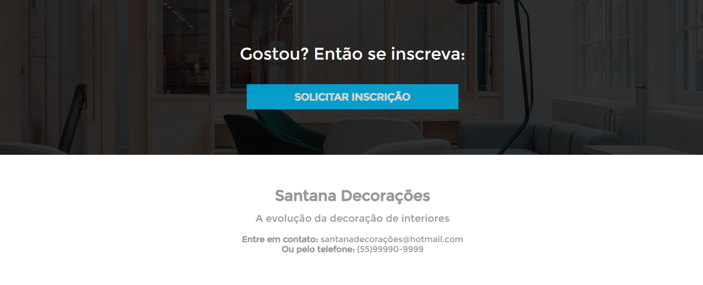

# Sobre o projeto:

Projeto de uma landing page fictícia desenvolvida em HTML5 e CSS3, onde o objetivo é mostrar as minhas habilidades de desenvolvimento front end web, principalmente na parte do CSS onde dá para treinar os posicionamentos das imagens na landing page usando o CSS Flexbox.

# Tecnologias utilizadas:

- HTML5, 
- CSS3 e
- Icons do Bootstrap;

# Layout do projeto:

## Primeira sessão da landing page:

## Segunda sessão da landing page:

## Terceira sessão da landing page:

## Quarta sessão da landing page:

## Quinta sessão da landing page:

## Sexta sessão da landing page:

## Sétima sessão da landing page:

## Autor:

Onde me encontrar?

- Entrar em contato comigo:

https://lsantana95.github.io/RocketLinks/ 